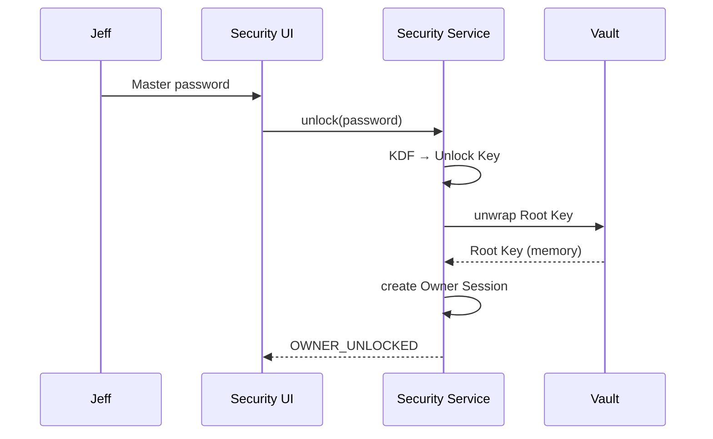
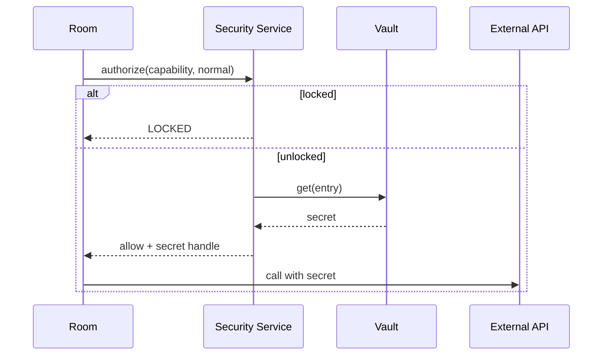
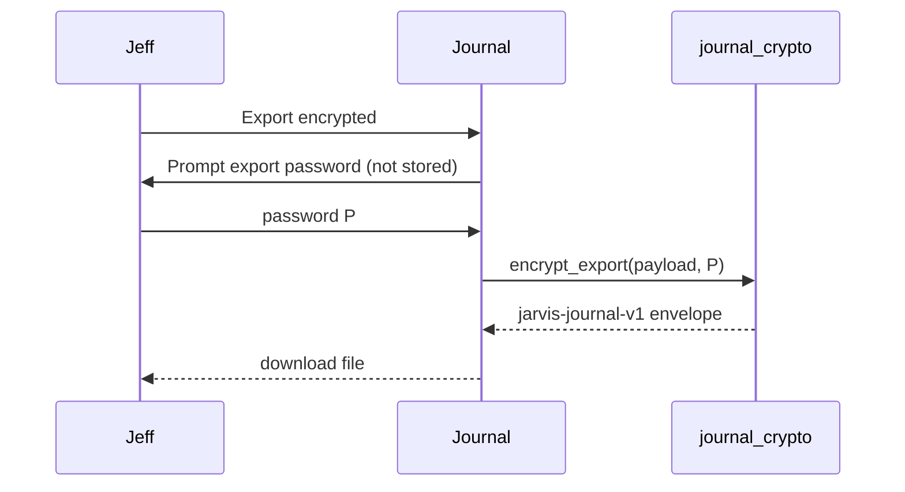

# ARIA — Owner Security / Secure Credential Vault Architecture

**Status:** M1 IMPLEMENTED; M2 provider dual-read LIVE PROVEN — M3+ NOT AUTHORIZED  
**Date:** 2026-08-12  
**Authority:** Capability-Driven Development + Production Integrity  
**Prerequisite stop:** Exhaustive verification halted at Journal encrypted import/export  
**M1 report:** `docs/ARIA_OWNER_SECURITY_VAULT_M1.md`  
**Review:** `docs/ARIA_OWNER_SECURITY_VAULT_ARCHITECTURE_REVIEW.md`  

**Related evidence**
- `docs/evidence/exhaustive_functional_verification/journal_encryption_design_readonly.json`
- `docs/evidence/exhaustive_functional_verification/WAITING_FOR_JEFF.json`
- `docs/evidence/exhaustive_functional_verification/EXHAUSTIVE_CHECKPOINT.json`

This document defines architecture, migration, and implementation phases.  
**No vault implementation is authorized until this architecture is reviewed.**

---

## 1. Problem statement

Aria today has **many unrelated credential surfaces**:

- PIN lock sessions
- Uncensored password sessions
- Health step-up grants
- Plaintext API keys / HA tokens in `data/jarvis.env`
- Ephemeral Journal/Health portable export passwords
- Host-delegated Git (`gh`)
- Browser profile cookies

Jeff must remember or re-enter different credentials for different Rooms. Secrets live mostly as **plaintext env vars**. Sessions do not share revocation. Portable encrypted exports are confused with “Aria passwords.”

**Goal:** one owner authentication → house-wide unlocked session → authorized vault access → per-capability credentials, with **step-up** for high-risk actions — without making the master password every system’s encryption key, and without making ACM a secret store.

**Non-goals (this architecture)**
- Recovering forgotten Aug 8 Journal export passwords
- Silently reusing the master password as portable export passwords
- Rewriting all Rooms in one pass
- Storing secrets as ACM memories

---

## 2. Current credential architecture

### Patterns in use today

| Pattern | Examples | Storage |
| --- | --- | --- |
| Ephemeral per-operation password | Journal encrypt export/import; Health backup create/restore | Not stored |
| Hashed local authenticator | Security PIN; Uncensored password | `data/security/pin.json`, `data/uncensored_auth.json` |
| Plaintext env secret bus | API keys, HA token, LAN API key, automation secret | `data/jarvis.env` (mode 0600) |
| Session bearer | PIN sessions; Uncensored sessions; Health step-up grants | Separate files / memory |
| Host-delegated | Git via `gh` CLI | Host keychain / gh config |
| Browser profile | Manual site logins | Playwright Chromium profile |

### Crypto already present

- `cryptography.fernet.Fernet` via `jarvis/journal_crypto.py`
- PBKDF2-HMAC-SHA256 (200k for journal envelopes; 120k for PIN/uncensored)
- `hmac.compare_digest` for secret compares
- `secrets.token_urlsafe` for session tokens

**Do not invent cryptography.** Extend these primitives.

### Critical current defects (must not worsen)

1. Three session systems without shared revocation  
2. Plaintext secrets dominate `jarvis.env`  
3. Health step-up accepts LAN API key as PIN substitute  
4. Journal at-rest env password is silent and leaves plaintext JSON beside `.enc`  
5. Health backup crypto is journal crypto with a retagged `format` field  
6. Export bundle can emit cleartext keys by design  

---

## 3. Current credential inventory

| Capability | Current credential | Storage | Current UI | Desired vault entry | Owner auth | Step-up |
| --- | --- | --- | --- | --- | --- | --- |
| Journal portable export | Ephemeral password (min 4) | Not stored | More → Export encrypted → `ariaPrompt` | *Not a vault secret* — portable export password remains separate | Session may authorize opening export UI | **Yes** — sensitive export |
| Journal portable import | Same as that file’s export password | Not stored | More → Import encrypted | *Not vault-recoverable* | Session | **Yes** |
| Journal at-rest (optional) | `JARVIS_JOURNAL_AT_REST_PASSWORD` | `jarvis.env` plaintext | None | Vault: `journal.at_rest` (or retire feature) | Unlocked | Configure = step-up |
| Health backup encrypt | Ephemeral password | Bundle ciphertext only | Health Backups | *Portable* — separate from vault | Session | **Yes** |
| Health step-up | PIN **or** LAN API key | Memory grants | 423 → prompt | Unify API-key path; vault-backed step-up | Unlocked | **Is** step-up |
| Security PIN | 4–6 digit PIN (hashed) | `data/security/pin.json` | Lock screen | Migrate → Owner Master Auth (strengthen) | Master unlock | Change PIN = step-up |
| PIN sessions | Bearer tokens | `sessions.json` + `sessionStorage` | Implicit | Replace with Owner Session | — | — |
| Trusted devices | Device ID + IP | `trusted_devices.json` | Lock “trust” | Keep as unlock convenience policy | Soft unlock aid | Manage = step-up |
| Uncensored mode | Password ≥12 (hashed) | `uncensored_auth.json` | Uncensored modal | Vault-gated capability flag + optional separate step-up | Unlocked | Enable/reveal = step-up |
| Uncensored env unlock | `JARVIS_UNCENSORED_PASSWORD` | `jarvis.env` plaintext | Script | Eliminate plaintext; vault or remove | — | — |
| OpenAI / Gemini / Anthropic / OpenRouter / HF / Meshy | API keys | `jarvis.env` | Integrations Home | Vault entries per provider | Unlocked | Reveal/export/rotate = step-up |
| Home Assistant | Long-lived token | `jarvis.env` `JARVIS_HA_TOKEN` | HA panel / chat set | Vault: `ha.token` | Unlocked | Reveal/change = step-up |
| Cloud Live | Reuses Gemini/OpenAI keys | Same | Voice / Cloud Live | Vault via provider keys | Unlocked | Connect = normal; reveal = step-up |
| LAN API key | Shared secret | `jarvis.env` + `sessionStorage` | LAN Access | Vault: `lan.api_key` | Unlocked / LAN gate | Reveal/rotate = step-up |
| Automation webhook secret | Auto `token_urlsafe` | `jarvis.env` | Automation Home | Vault: `automation.webhook` | Unlocked | Reveal/rotate = step-up |
| Git / GitHub | Host `gh` credentials | Not in Aria | Coding shell | Optional vault mirror later; default remains host `gh` | Unlocked | Push/destructive = step-up |
| Browser site logins | Chromium profile | Project `pw_profile` | Browser Room | Keep profile; vault only for Aria-managed site secrets if added | Unlocked | Export profile = step-up |
| Graph DB (Memgraph/Neo4j) | Bolt user/password | `jarvis.env` | None | Vault: `graph.bolt` | Unlocked | Change = step-up |
| Postgres (if used) | Password | `jarvis.env` | None | Vault: `postgres` | Unlocked | Change = step-up |
| Connections / Providers | Mostly provider keys above | Integrations bus | Rooms | Vault-backed | Unlocked | — |
| ACM | Must not store secrets | Memories | — | Metadata only | — | — |

Inventory is evidence-based from code search (2026-08-12). Re-scan before each migration phase.

---

## 4. Target architecture

```
┌─────────────────────────────────────────────────────────────┐
│                         OWNER                               │
│  Identity · Master Authentication · Recovery policy         │
└───────────────────────────┬─────────────────────────────────┘
                            │ unlock / lock / step-up
┌───────────────────────────▼─────────────────────────────────┐
│                    SECURITY SERVICE                         │
│  Session · Authorization · Step-up · Audit (no secrets)     │
└───────┬─────────────────────┬───────────────────┬───────────┘
        │                     │                   │
        ▼                     ▼                   ▼
┌───────────────┐   ┌─────────────────┐   ┌──────────────┐
│ OWNER SESSION │   │  SECURE VAULT   │   │ CAPABILITY   │
│ LOCKED|UNLOCK │   │ Root Key +      │   │ GATE         │
│ house-wide    │   │ encrypted entries│   │ per Room/API │
└───────────────┘   └────────┬────────┘   └──────┬───────┘
                             │                    │
                             │ secrets            │ allow/deny
                             ▼                    ▼
                    ┌────────────────────────────────────┐
                    │ ROOMS / INTEGRATIONS / TOOLS       │
                    │ request capability, never own auth │
                    └────────────────────────────────────┘

ACM ←── metadata only (“HA connected”) ──┘
Portable exports ←── separate passwords (never = master) ──┘
```

---

## 5. Owner identity

Single local owner (Jeff) for this Aria instance.

| Attribute | Meaning |
| --- | --- |
| Owner ID | Stable local id (e.g. `owner:primary`) |
| Authenticator | Master password (and optional future factors) |
| State | `OWNER_LOCKED` \| `OWNER_UNLOCKED` |
| Policy | Idle lock off by default; lockout; step-up catalog |

Not a multi-tenant IAM system. Not cloud SSO (unless later explicitly designed).

---

## 6. Master authentication

### Unlock

1. Jeff enters **Owner Master Password** (and any future factor).  
2. KDF derives **Vault Unlock Key**.  
3. Unlock Key unwraps **Vault Root Key** (stored encrypted at rest).  
4. Security Service creates **Owner Session** (house-wide).  
5. State → `OWNER_UNLOCKED`.

### Rules

- Master password is **never** stored recoverable.  
- Master password is **never** used directly as Fernet key for every secret.  
- Master password is **never** silently reused as Journal/Health portable export password.  
- Failed attempts: rate limit + temporary lockout; **must not** permanently brick without recovery path (preserve Aria’s “no permanent Lock Now lockout” class of guarantees).

### Relationship to today’s PIN

Phase 1 may treat strengthened PIN / password as the master authenticator, migrating `pin.json` carefully. PIN strength today (4–6 digits) is insufficient long-term for vault root — migration must upgrade KDF + minimum strength without locking Jeff out.

---

## 7. Vault

### Purpose

Store **secret material** for Aria capabilities.

### Non-purpose

- Not ACM memory  
- Not portable export format  
- Not Activity / diagnostics dump  

### Entry model (conceptual)

```text
vault_entry:
  id: "ha.token"
  kind: "bearer_token" | "api_key" | "password" | "oauth_refresh" | ...
  label: "Home Assistant"
  meta: { rotated_at, last_used_at, scope }   # non-secret
  ciphertext: <authenticated encryption blob>
  wrapping: <key id / version>
```

### Access API (conceptual)

```text
Security.authorize(capability, risk) → ok | step_up_required | locked
Vault.get(entry_id) → secret   # only if authorized + unlocked
Vault.put(entry_id, secret)    # step-up for writes of high-risk kinds
Vault.meta(entry_id) → safe metadata for ACM/UI
```

Plaintext secrets exist only in process memory while unlocked, for minimum duration.

---

## 8. Vault cryptographic model

Use established libraries already in-tree (`cryptography`).

| Layer | Spec (target) |
| --- | --- |
| Password KDF | **Argon2id only** (pinned M1): t=3, m=65536 KiB, p=4, hash_len=32 — library `argon2-cffi`. **No PBKDF2 fallback.** |
| Salt | 16+ bytes `os.urandom`, stored with verifier / wrapped root |
| Vault Root Key | 256-bit random; encrypted under unlock key |
| Entry encryption | AES-GCM or Fernet (AEAD); unique nonce/IV per entry |
| Integrity | AEAD tag; optional outer checksum for backup packages |
| Key rotation | New root version; re-wrap entries; retire old version after verify |
| Credential rotation | Per-entry `rotated_at`; hygiene reminders become actionable |
| Memory | Zeroize buffers where practical; no secret logging |

**Explicit:** portable Journal/Health export envelopes remain `jarvis-journal-v1` / health format via existing `journal_crypto` — **separate** from vault root.

---

## 9. Session model

| State | Meaning |
| --- | --- |
| `OWNER_LOCKED` | Vault Root Key inaccessible; protected ops denied or prompt unlock |
| `OWNER_UNLOCKED` | Session valid; normal protected ops allowed per policy |
| `STEP_UP_VALID` | Short-lived elevation for high-risk ops |

### Lifetime (defaults — tunable)

| Event | Behavior |
| --- | --- |
| Successful unlock | House-wide session |
| Room change | **No** re-auth |
| Idle | **No automatic re-lock.** Daily-use Owner session stays `OWNER_UNLOCKED` until explicit Lock Aria, restart/shutdown, or a genuine security-critical revoke. Opt-in timeout: `JARVIS_OWNER_IDLE_SECONDS` only (0 / unset = off). PIN-era `JARVIS_LOCK_IDLE_SEC` is ignored. |
| Explicit Lock | Immediate revoke session + wipe in-memory root |
| App restart | **Locked** (secure default) |
| Machine restart | Locked |
| Browser refresh | Server session may persist briefly; client must re-attach safely — prefer **locked on full process restart**; document tab refresh policy |
| Multi-tab | One owner session; lock in one tab locks all |
| Failed auth | Backoff; no permanent lockout without recovery |

---

## 10. Lock model

```
UNLOCKED ──(explicit Lock Aria | restart/shutdown | security-critical revoke)──► LOCKED
LOCKED ──(master auth success)──► UNLOCKED
Idle time does not lock. Opt-in only: JARVIS_OWNER_IDLE_SECONDS > 0.
```

**Invariant:** Lock Now must **not** permanently lock Jeff out of his machine’s Aria without a recovery path (existing PIN recovery / setup assumptions preserved and improved, not removed).

On lock:

1. Revoke owner sessions (unified — unlike today’s PIN-only revoke)  
2. Drop in-memory Vault Root Key  
3. Clear step-up grants  
4. Uncensored / Health elevations end  

---

## 11. Step-up authentication

| Risk | Examples | Requirement |
| --- | --- | --- |
| Normal (unlocked) | Use HA token to call HA; use provider key for generation; read “connected” status | Owner session |
| Step-up | Change master password; reveal secret in UI; export secrets bundle; delete PHR; disable security; destructive Git push; wipe Journal replace-all; rotate LAN key | Recent re-auth (master password / PIN) |

Health’s current step-up catalog is a starting point — **remove LAN API key as step-up authenticator**.

---

## 12. Capability authorization

Rooms do not authenticate.

```
Room/API → Security.authorize("integrations.openai.use", risk=normal)
        → Vault.get("openai.api_key")   # if allowed
        → perform capability
```

Capability IDs should be stable strings owned by Security, listed in a registry.

ACM may observe `authorize` outcomes as metadata (“OpenAI available”), never the key.

---

## 13. Room integration

Shared interface (phased adoption):

| Room / surface | Adoption |
| --- | --- |
| Security | Owns unlock UI + lock + policy |
| Integrations / Providers | First vault consumers (API keys) |
| Home Automation | HA token via vault |
| Health | Step-up via Security; backup passwords remain portable |
| Journal | Portable export/import UX clarity; optional future “remember export password in vault” is **opt-in explicit**, never silent master reuse |
| Coding / Git | Prefer host `gh`; vault only if Aria-stored PAT is introduced |
| Browser | Profile remains; no secret dump to ACM |
| Actions / Automation | Webhook secret via vault |
| Cloud Live / Voice | Provider keys via vault |
| Connections | Graph password via vault |

---

## 14. ACM boundary

| Allowed in ACM | Forbidden in ACM |
| --- | --- |
| “Home Assistant connected” | HA token |
| “OpenAI key configured” | API key material |
| “Owner vault unlocked” (careful) | Master password, root key, entry ciphertext plaintext |

Vault → ACM events: metadata-only hooks.

---

## 15. Credential migration

Principles:

1. Non-destructive  
2. Validate before import  
3. Dual-read during transition  
4. Rollback until Jeff confirms  
5. Retire old store last  

### Per-secret flow

```
OLD → read → validate still works → wrap into vault entry →
verify capability with vault path → keep old until ACK →
then stop writing old → later delete old after backup
```

### Phase order (high level)

1. Security Service + empty vault + unlock/lock (PIN bridge)  
2. Migrate `jarvis.env` API keys / HA / LAN / automation secrets  
3. Unify session revocation (PIN + uncensored + health grants)  
4. Journal UX honesty (no format break)  
5. Health step-up cleanup  
6. Retire plaintext env for migrated keys  

---

## 16. Journal integration

| Concern | Policy |
| --- | --- |
| `jarvis-journal-v1` | **Preserve** |
| Aug 8 owner files | Valid; require original export-time password; **not recoverable**; do not modify |
| Export encrypted UX | Explicit: “Password is not stored by Aria.” Optional generate-and-show (Jeff must save it) |
| Import encrypted UX | Explicit: “Requires the password used when this file was exported.” |
| Master password | Never silent export password |
| Future opt-in | “Store this export password in vault” checkbox — step-up, explicit |

---

## 17. Portable export separation

```
Owner Master Password  →  Vault Root Key  →  stored secrets
Export Password        →  jarvis-journal-v1 / health backup envelope  →  files that leave Aria
```

Two boundaries. Crossing them silently is a design defect.

---

## 18. Recovery

| Scenario | Approach |
| --- | --- |
| Forgot master password | Recovery material (printed recovery codes / key file) created at vault init — **Jeff-attended**; without it, vault secrets unrecoverable by design |
| Forgot portable export password | That file stays sealed; export a **new** file with a new password |
| Lost PIN today | Preserve current non-permanent lockout behavior; improve messaging |
| Corrupted vault file | Restore from Integrity/backup; dual-store during migration |

---

## 19. Backup

- Vault ciphertext included in Aria backups as **opaque** blobs  
- Backup encryption (future) must not write plaintext secrets into JSON exports  
- `export_bundle(include_values=True)` must become step-up + warning + vault-aware, or removed from casual paths  
- Integrity scans check for plaintext secret patterns without logging values  

---

## 20. Rotation

- Vault Root Key rotation: re-wrap entries  
- Per-credential rotation: Integrations hygiene becomes actionable  
- Session token rotation on unlock  
- Portable export passwords: rotate by creating a new export  

---

## 21. Revocation

| Revoke | Effect |
| --- | --- |
| Lock | All sessions + memory keys |
| Rotate LAN key | Invalidate clients |
| Delete vault entry | Capability fails closed |
| Untrust device | Device bypass ends |

---

## 22. Failure behavior

| Failure | Owner-visible | System |
| --- | --- | --- |
| Locked | “Unlock Aria to continue” | No secret access |
| Wrong master password | Honest failure + backoff | No unlock |
| Missing vault entry | “Not configured” | Fail closed |
| Wrong portable export password | “Wrong password or corrupt file” | No import |
| Unknown export format | Honest format error | No import |
| Migration verify fail | Stop migration; keep old | Rollback |

---

## 23. Security threats

| Threat | Mitigation |
| --- | --- |
| Plaintext `jarvis.env` theft | Migrate into vault AEAD |
| Session file theft | Hash/store session verifiers; short TTL |
| XSS reading secrets | Minimize DOM exposure; no secret in ACM/Activity |
| Master password = export password confusion | UX + separate APIs |
| Permanent lockout | Recovery codes; preserve unlock paths |
| Timing attacks | Keep `hmac.compare_digest` |
| Log leakage | Redaction middleware; tests for secret absence |
| Confused deputy (LAN key as Health step-up) | Remove |

---

## 24. Performance implications

| Operation | Budget target (local) | Notes |
| --- | --- | --- |
| Unlock (KDF once) | Noticeable but rare; measure; avoid UI freeze of other Rooms | Run KDF off critical paint path |
| Vault init after unlock | < 100–200 ms warm | Cache root in memory while unlocked |
| Credential get | < 5–20 ms cached | **No** KDF per get |
| Room entry | Unchanged from repaired baselines | No vault I/O on enter unless needed |
| Step-up | Prompt + one KDF verify | Not on every Room nav |

**Forbidden:** repeated PBKDF on every HA call; blocking Room enter on vault cold start; duplicate secret fetches.

Measure: unlock, init, get, step-up, lock, unlock-after-lock, restart, first vs subsequent protected op.

---

## 25. Data-flow diagrams

### Unlock



### Protected Room use



### Portable Journal export (separate)



---

## 26. Migration phases

| Phase | Deliverable | Production rule |
| --- | --- | --- |
| **M0** | This architecture reviewed | No code |
| **M1** | Security Service skeleton + Owner Session (bridge PIN) + empty vault | Isol tests only |
| **M2** | Migrate Integrations secrets from `jarvis.env` → vault (dual-read) | Jeff-attended verify |
| **M3** | HA + LAN + automation secrets | Jeff-attended |
| **M4** | Unify lock/revoke; fix Health step-up | Isol + Jeff |
| **M5** | Journal/Health portable UX honesty (no format break) | UI only |
| **M6** | Stop writing migrated plaintext env keys; retain rollback snapshot | Integrity clean/100 |
| **M7** | Optional: vault opt-in “remember export password” | Explicit UX |

Each phase: Integrity scan; no QA credentials in live; disposable vault for automation.

---

## 27. Rollback strategy

| Phase | Rollback |
| --- | --- |
| M1 | Feature-flag off; PIN path unchanged |
| M2–M3 | Dual-read prefers old store; delete vault entries; keep `jarvis.env` |
| M4 | Restore prior step-up module from git; sessions files backup |
| M5 | Revert UI strings/handlers only |
| M6 | Restore `jarvis.env` from pre-cut snapshot (encrypted backup preferred) |

**Stop condition:** if rollback unclear → do not cut over.

---

## 28. Testing strategy

| Test type | Vault data | Real Jeff secrets |
| --- | --- | --- |
| Unit crypto | Synthetic | Never |
| Isol vault | `JARVIS_DATA_DIR` disposable | Never |
| Live smoke | Read-only probes | Jeff-attended |
| Exhaustive verification | Resume Journal gate | Jeff enters credentials in Aria UI only |

Maintain: QA header → 403; test-shaped → 400/refused.

---

## 29. Jeff-attended requirements

| Gate | Why |
| --- | --- |
| Master password creation | Owner secret |
| Unlock after restart | Owner secret |
| Migration verify per integration | Prove live capabilities still work |
| Journal export/import after UX fix | Exhaustive checkpoint resume |
| Any reveal of vault secret | Step-up + owner presence |

**Never:** guess, inject, skip, fake, or mark untested as passed.

---

## Implementation plan (after architecture approval only)

1. Review/approve this document  
2. M1 Security Service + session bridge (isol)  
3. M2–M3 secret migration (Jeff-attended verifies)  
4. M4 session unification + Health step-up fix  
5. M5 Journal portable UX  
6. Resume exhaustive verification at Journal encrypted import/export checkpoint  
7. Continue Rooms with STOP/WAIT FOR JEFF on credentials  

**NO CODE in this step beyond documentation and checkpoint persistence.**

---

## Exhaustive verification checkpoint (must preserve)

See `docs/evidence/exhaustive_functional_verification/EXHAUSTIVE_CHECKPOINT.json`.

| Field | Value |
| --- | --- |
| Room | Journal |
| Capability | Encrypted Import |
| Workflow | Journal → More → Import encrypted |
| Completed | More menu repaired; export JEFF-ATTENDED; encryption design clarified; Aug 8 files valid but password unknown/unrecoverable |
| Current | Waiting for correct owner export/password **workflow** (new export with known password, or remembered Aug 8 password — Jeff’s choice; do not guess) |
| Do not | Restart from Room 1; skip gate; recover Aug 8 password via vault |

---

## STOP

Architecture and inventory documented.  
**Do not implement the vault until this document is reviewed and accepted.**

Integrity expectation after any future migration step: **clean / 100** when genuinely clean.
