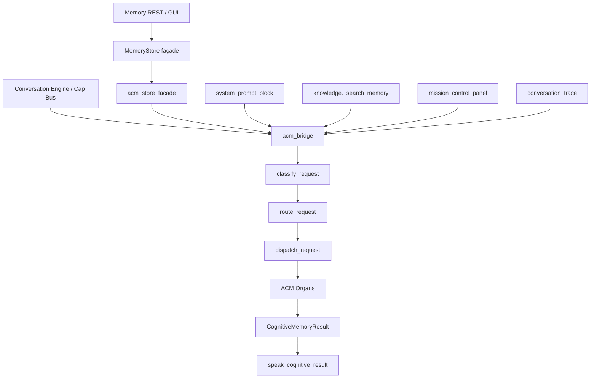

# Dependency Graph — Cognitive Infrastructure → ACM

**Date:** 2026-07-15  
**Companion:** `docs/DEPENDENCY_AUDIT.md`

## Legend

- **Term** = cognitive termination point (must be ACM organ / Memory Authority)
- **Risk** = H/M/L if legacy still executable under PRIMARY
- **Validation** = test / CI gate

## Graph (execution)

## Mapped dependencies

| Current module | Current impl | Dependency | Termination | Legacy ref | ACM replacement | Migration | Risk | Validation | Removal plan |
|----------------|--------------|------------|-------------|------------|-----------------|-----------|------|------------|--------------|
| Cap Bus | capability_bus | acm_bridge primary_* | ACM organs | none under PRIMARY | D038–D040 | done M3/M0C | L | m0c/m3/m4 | N/A |
| MemoryEngine | behaviors/memory | Cap Bus / bridge | ACM | store only façade | primary_* | done | L | m3/m4 | N/A |
| JsonMemoryStore | modules/memory | acm_store_facade | ACM project_* | JSON vault | project_list/search | CIC | L | cic-01/02 | vault only |
| SqliteMemoryStore | memory_sqlite | acm_store_facade | ACM | SQLite vault | same | CIC | L | cic-01/02 | vault only |
| system_prompt_block | memory_context | system_prompt_from_acm | ACM speak | list_entries fallback ROLLBACK | ACM speak | CIC | L | cic-05 | sever fallback later |
| knowledge search | knowledge/search | primary_search | remembering | assistant.memory ROLLBACK | primary_search | CIC | L | cic + knowledge tests | N/A |
| mission_control_panel | memory_manager | acm_dashboard | ACM dashboard | ROLLBACK panel | acm_dashboard | CIC | L | cic-03 | legacy panel ROLLBACK-only |
| conversation_trace | conversation_trace | last_primary_op | ACM diagnostics | v2 thin fields | memory_operation.v3 | CIC | L | cic-04 | done |
| specialized writers | experience/trust/… | redirect_legacy_write | encode | store.add blocked | primary_remember | M4 | L | m4-03 | done |
| hierarchy consolidate | memory/hierarchy | no-op PRIMARY | N/A | legacy consolidate | disabled | M4 | L | supremacy | done |
| DualWrite | adapter_store | identity wrap | N/A | platform auth | disabled | M4 | L | m4-02 | keep module inert |
| harvest | acm_harvest | encode INTO ACM | ACM | MemoryStore read | Experiences | M2 | L | m2 | retain operator |
| vault script | acm_vault_* | filesystem | N/A | legacy files | operator | M4 | L | manual | retain |

## Unmapped items

**None.** All audited cognitive dependencies are mapped above or explicitly justified as non-cognitive / ROLLBACK-only in the audit.
